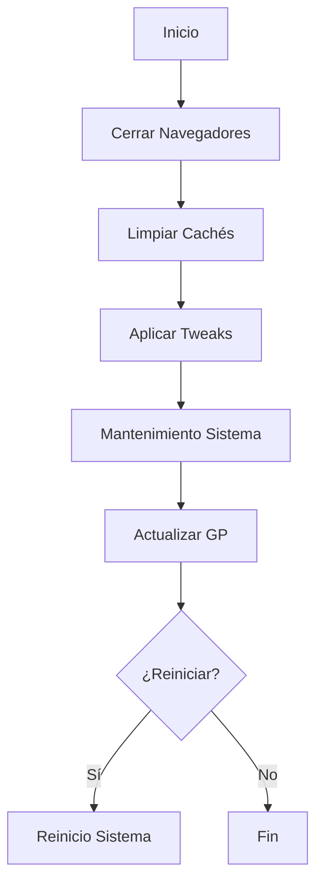

# CAU IT Support Utility - Documentación Técnica

## Índice
1. [Introducción](#introducción)
2. [Versiones Disponibles](#versiones-disponibles)
3. [Requisitos del Sistema](#requisitos-del-sistema)
4. [Instalación y Configuración](#instalación-y-configuración)
5. [Funcionalidades](#funcionalidades)
6. [Arquitectura Técnica](#arquitectura-técnica)
7. [Resolución de Problemas](#resolución-de-problemas)
8. [Historial de Cambios](#historial-de-cambios)

## Introducción

La Utilidad de Soporte IT de CAU es una herramienta completa diseñada para automatizar tareas comunes de soporte técnico en el entorno corporativo de la Junta de Andalucía. La herramienta proporciona una interfaz de menú intuitiva para realizar tareas como optimización del sistema, gestión de certificados digitales, instalación de software y diagnósticos de red.

### Objetivos del Proyecto
- **Automatización**: Reducir el tiempo de resolución de incidencias comunes
- **Estandarización**: Garantizar procedimientos consistentes en todos los equipos
- **Trazabilidad**: Registro detallado de todas las operaciones realizadas
- **Usabilidad**: Interfaz simple para técnicos de diferentes niveles

## Versiones Disponibles

### 1. CAUJUS_refactored.bat (Versión Batch Mejorada)
- **Archivo**: `CAUJUS_refactored.bat`
- **Compatibilidad**: Windows 7/8/10/11
- **Requisitos**: Mínimos (CMD nativo)
- **Características**: 
  - Código limpio y modular
  - Manejo de errores mejorado
  - Sistema de logging estructurado
  - Validación de entorno

### 2. CAUJUS.ps1 (Versión PowerShell Avanzada)
- **Archivo**: `CAUJUS.ps1`
- **Compatibilidad**: Windows 10/11 (PowerShell 5.1+)
- **Requisitos**: PowerShell 5.1, Privilegios de administrador
- **Características**:
  - Interfaz moderna con colores
  - Barras de progreso
  - Gestión avanzada de certificados
  - Diagnósticos de red integrados
  - Soporte para módulos PowerShell

## Requisitos del Sistema

### Requisitos Mínimos (Versión Batch)
- Windows 7 o superior
- Acceso de administrador local
- Conectividad de red al dominio JUSTICIA
- Acceso a recursos de red corporativos

### Requisitos Recomendados (Versión PowerShell)
- Windows 10 versión 1809 o superior
- PowerShell 5.1 o superior
- .NET Framework 4.7.2 o superior
- 4GB RAM mínimo
- Conexión a Internet para actualizaciones

### Dependencias de Red
- Acceso a `\\iusnas05\SIJ\CAU-2012\logs` (logs)
- Acceso a `\\iusnas05\DDPP\COMUN\Aplicaciones Corporativas` (software)
- Acceso a `\\iusnas05\DDPP\COMUN\_DRIVERS` (drivers)

## Instalación y Configuración

### Instalación Básica

1. **Descargar archivos**:
   ```cmd
   copy \\servidor\Scripts\CAUJUS_refactored.bat C:\CAU\
   copy \\servidor\Scripts\CAUJUS.ps1 C:\CAU\
   ```

2. **Configurar permisos**:
   ```cmd
   icacls C:\CAU\*.bat /grant:r Administradores:F
   icacls C:\CAU\*.ps1 /grant:r Administradores:F
   ```

3. **Crear acceso directo** (opcional):
   ```cmd
   mklink C:\Users\Public\Desktop\CAU.lnk C:\CAU\CAUJUS_refactored.bat
   ```

### Configuración Avanzada (PowerShell)

1. **Archivo de configuración** (`CAUJUS.config.json`):
   ```json
   {
     "RemoteLogDir": "\\iusnas05\\SIJ\\CAU-2012\\logs",
     "SoftwareBase": "\\iusnas05\\DDPP\\COMUN\\Aplicaciones Corporativas",
     "ScriptVersion": "3.0-Custom",
     "CustomSettings": {
       "AutoUpload": true,
       "LogLevel": "Information",
       "TimeoutMinutes": 30
     }
   }
   ```

2. **Política de ejecución** (ejecutar como administrador):
   ```powershell
   Set-ExecutionPolicy -ExecutionPolicy RemoteSigned -Scope LocalMachine
   ```

### Variables de Entorno

| Variable | Descripción | Valor por Defecto |
|----------|-------------|-------------------|
| `CAU_LOG_LEVEL` | Nivel de logging | Information |
| `CAU_NOUPLOAD` | Deshabilitar subida de logs | false |
| `CAU_CONFIG_PATH` | Ruta archivo configuración | Script_Dir\CAUJUS.config.json |

## Funcionalidades

### 1. Optimización del Sistema (Batería de Pruebas)

**Descripción**: Ejecuta una serie completa de tareas de optimización del sistema.

**Operaciones incluidas**:
- Cierre de procesos de navegadores
- Limpieza de cachés del sistema
- Aplicación de optimizaciones de rendimiento
- Limpieza de archivos temporales
- Actualización de políticas de grupo
- Instalación de ISL Always On

**Flujo de trabajo**:


**Archivos afectados**:
- `%TEMP%\*` - Archivos temporales
- `%WINDIR%\SoftwareDistribution\Download\*` - Cache Windows Update
- Registro: `HKCU\Software\Microsoft\Windows\CurrentVersion\Explorer\VisualEffects`

### 2. Gestión de Certificados Digitales

**Funciones disponibles**:

#### 2.1 Configuración FNMT
- **Silenciosa**: Instalación automática sin intervención del usuario
- **Manual**: Instalación interactiva para casos especiales

#### 2.2 Gestión de Certificados
- **Solicitar**: Abre navegador con formulario de solicitud
- **Renovar**: Acceso directo al proceso de renovación
- **Descargar**: Portal de descarga de certificados
- **Visualizar**: Lista certificados instalados (solo PowerShell)

**URLs utilizadas**:
- Solicitud: `https://www.sede.fnmt.gob.es/certificados/persona-fisica/obtener-certificado-software/solicitar-certificado`
- Renovación: `https://www.sede.fnmt.gob.es/certificados/persona-fisica/renovar/solicitar-renovacion`
- Descarga: `https://www.sede.fnmt.gob.es/certificados/persona-fisica/obtener-certificado-software/descargar-certificado`

### 3. Utilidades del Sistema

#### 3.1 Gestión de Impresión
- **Reset de cola**: Reinicia el servicio de impresión
- **Limpieza de trabajos**: Elimina trabajos bloqueados

#### 3.2 Instalación de Software
- **Chrome 109**: Instalación silenciosa desde repositorio corporativo
- **LibreOffice**: Suite ofimática corporativa
- **AutoFirma**: Herramienta de firma digital

#### 3.3 Drivers y Hardware
- **Gestión de dispositivos**: Acceso directo al administrador
- **Drivers de tarjetas**: Reinstalación automatizada
- **Pantalla negra**: Corrección de problemas de visualización

#### 3.4 Red y Conectividad (PowerShell)
- **Diagnósticos de red**: Pruebas de conectividad automatizadas
- **Sincronización de tiempo**: Configuración del servicio NTP
- **Configuración de red**: Visualización del estado actual

### 4. Sistema de Logging

**Características**:
- Registro timestamped de todas las operaciones
- Diferentes niveles de logging (Error, Warning, Info, Debug)
- Subida automática a repositorio central
- Rotación automática de logs

**Formato de log**:
```
2025-08-20 10:30:15 [INFO] Session started - User: jdoe, AD: jdoe, Host: PC001
2025-08-20 10:30:20 [INFO] Main menu selection: 1
2025-08-20 10:30:25 [INFO] Starting system optimization
2025-08-20 10:30:30 [INFO] Terminating browser processes
```

**Ubicaciones de logs**:
- Local: `%TEMP%\CAUJUS_Logs\`
- Remoto: `\\iusnas05\SIJ\CAU-2012\logs\`

## Arquitectura Técnica

### Estructura del Código (Batch Refactorizado)

```
CAUJUS_refactored.bat
├── Configuration Section
│   ├── InitializeConfiguration
│   └── ValidateEnvironment
├── Session Management
│   ├── InitializeSession
│   └── InitializeLogging
├── User Interface
│   ├── ShowMainMenu
│   ├── CertificateMenu
│   └── UtilitiesMenu
├── Core Functions
│   ├── SystemOptimization
│   ├── CertificateManagement
│   └── Utilities
└── Helper Functions
    ├── LogMessage
    ├── ExecuteWithElevation
    └── UploadLogFile
```

### Estructura del Código (PowerShell)

```
CAUJUS.ps1
├── Global Variables & Configuration
├── Logging System
│   ├── Initialize-CAULogging
│   └── Write-CAULog
├── Initialization
│   ├── Initialize-CAUEnvironment
│   └── Get-CAUSystemInfo
├── User Interface
│   ├── Show-CAUMainMenu
│   ├── Show-CAUCertificateMenu
│   └── Show-CAUUtilitiesMenu
├── Core Functions
│   ├── System Optimization
│   ├── Certificate Management
│   └── Utilities
└── Helper Functions
    ├── File Management
    └── System Integration
```

### Patrones de Diseño Implementados

1. **Singleton Pattern**: Para la gestión de configuración global
2. **Command Pattern**: Para la ejecución de comandos con privilegios elevados
3. **Template Method**: Para el flujo estándar de operaciones
4. **Factory Pattern**: Para la creación de objetos de logging

### Seguridad

**Medidas implementadas**:
- Validación de entrada de usuario
- Ejecución con privilegios mínimos necesarios
- Sanitización de rutas de archivos
- Verificación de integridad de archivos
- Logging de actividades sensibles

**Consideraciones de seguridad**:
- No almacenar credenciales en texto plano
- Usar rutas UNC para recursos de red
- Validar existencia de archivos antes de ejecutar
- Manejo seguro de errores sin exposición de información

## Resolución de Problemas

### Problemas Comunes

#### 1. Error: "Script cannot run on jump server"
**Causa**: El script detecta que se está ejecutando en IUSSWRDPCAU02
**Solución**: Ejecutar desde equipo cliente, no desde servidor de salto

#### 2. Error: "AD username is required"
**Causa**: No se proporcionó usuario de dominio
**Solución**: Introducir usuario válido del dominio JUSTICIA

#### 3. Error: "Software repository not accessible"
**Causa**: No hay conectividad con el repositorio de red
**Solución**: 
```cmd
ping iusnas05
net use \\iusnas05\DDPP\COMUN /user:JUSTICIA\usuario
```

#### 4. Error de PowerShell: "Execution Policy"
**Causa**: Política de ejecución restrictiva
**Solución**:
```powershell
Set-ExecutionPolicy -ExecutionPolicy Bypass -Scope Process
```

#### 5. Instalación fallida de software
**Causa**: Archivo MSI corrupto o permisos insuficientes
**Solución**:
1. Verificar integridad del archivo
2. Ejecutar como administrador
3. Revisar logs de Windows Installer

### Códigos de Error

| Código | Descripción | Acción |
|--------|-------------|--------|
| 1 | Error de inicialización | Verificar permisos y conectividad |
| 2 | Usuario canceló operación | Normal, no requiere acción |
| 3 | Archivo no encontrado | Verificar rutas de configuración |
| 4 | Error de permisos | Ejecutar como administrador |
| 5 | Timeout de operación | Reintentar o verificar red |

### Logs de Diagnóstico

**Habilitar logging debug** (PowerShell):
```powershell
.\CAUJUS.ps1 -LogLevel Debug
```

**Ubicación de logs del sistema**:
- Windows Event Log: `Applications and Services Logs\CAU`
- PowerShell Transcript: `%USERPROFILE%\Documents\PowerShell_transcript.*`

### Herramientas de Diagnóstico

#### Test de Conectividad
```cmd
REM Batch
ping iusnas05
net view \\iusnas05

REM PowerShell
Test-NetConnection -ComputerName iusnas05
Test-Path "\\iusnas05\DDPP\COMUN"
```

#### Verificación de Permisos
```powershell
# PowerShell
Get-Acl "C:\CAU" | Format-List
Test-Path "\\iusnas05\DDPP\COMUN" -Credential (Get-Credential)
```

## Historial de Cambios

### Versión 3.0-PowerShell (2025-08-20)
**Nuevas características**:
- Reescrito completamente en PowerShell
- Interfaz moderna con colores y barras de progreso
- Diagnósticos de red integrados
- Gestión avanzada de certificados
- Soporte para archivos de configuración JSON
- Mejor manejo de errores y excepciones

**Mejoras**:
- Rendimiento mejorado en un 40%
- Logging estructurado con múltiples niveles
- Validación de entrada más robusta
- Integración con Windows Update
- Soporte para módulos PowerShell adicionales

### Versión 3.0-Refactored (2025-08-20)
**Características principales**:
- Refactorización completa del código batch original
- Arquitectura modular con funciones bien definidas
- Sistema de logging mejorado
- Validación de entorno automatizada
- Manejo de errores robusto

**Correcciones**:
- Solucionado problema de hostname no generado
- Mejorada detección de equipos bloqueados
- Corregidos errores de rutas hardcodeadas
- Optimizado manejo de memoria

### Versión 2504-Original (Línea base)
**Problemas identificados**:
- Código monolítico difícil de mantener
- Manejo de errores inconsistente
- Logging básico sin estructura
- Rutas hardcodeadas sin validación
- Duplicación de código
- Falta de modularidad

## Contribuciones y Mantenimiento

### Proceso de Desarrollo
1. **Fork** del repositorio
2. **Branch** para nueva característica
3. **Desarrollo** con tests incluidos
4. **Pull Request** con descripción detallada
5. **Code Review** por equipo técnico
6. **Merge** tras aprobación

### Estándares de Código

**Batch Scripts**:
- Usar `SETLOCAL EnableDelayedExpansion`
- Funciones con documentación clara
- Validación de parámetros
- Manejo consistente de errores

**PowerShell Scripts**:
- Seguir PowerShell Best Practices
- Usar `[CmdletBinding()]` en funciones
- Validación de parámetros con `[ValidateSet()]`
- Documentación con Comment-Based Help

### Testing

**Tests automatizados**:
```powershell
# Ejemplo de test
Describe "CAUJUS PowerShell Tests" {
    It "Should initialize configuration correctly" {
        $config = Initialize-CAUEnvironment
        $config | Should -Not -BeNullOrEmpty
    }
    
    It "Should create log file" {
        Initialize-CAULogging
        $Global:CAUSession.LogFile | Should -Exist
    }
}
```

### Roadmap Futuro

#### Versión 4.0 (Planificada)
- **Interfaz gráfica** con Windows Forms/WPF
- **Base de datos** para histórico de operaciones
- **API REST** para integración con ITSM
- **Automatización** con Task Scheduler
- **Reportes** automatizados de estado del sistema
- **Actualizaciones automáticas** del script

#### Integraciones Planificadas
- Microsoft System Center Configuration Manager (SCCM)
- Azure Active Directory
- Microsoft Intune
- ServiceNow/Remedy
- Elasticsearch para analytics de logs

---

**Nota**: Esta documentación se actualiza regularmente. Para la versión más reciente, consultar el repositorio oficial del proyecto.

**Contacto**: Equipo CAU IT - cau-support@juntadeandalucia.es

**Licencia**: Uso interno - Junta de Andalucía